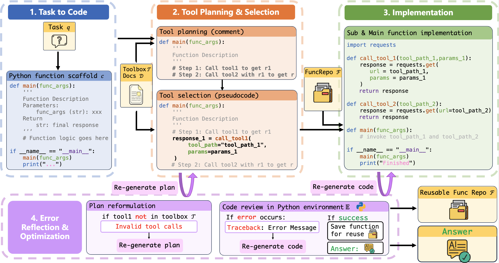

# ToolCoder: Enhancing Tool Learning through Code-Centric Task Planning and Execution

### Overview of **ToolCoder** 🚀  

**ToolCoder** is an innovative framework that redefines **tool learning** for large language models (LLMs) by transforming it into a **code completion** task. Unlike conventional approaches that struggle with **cross-task planning inconsistencies**, **multi-step structured execution**, and **error handling**, ToolCoder introduces a **code-centric paradigm** to enhance accuracy and reliability.  

🔹 **Key Features & Innovations:**  
✅ **Code-Driven Task Execution**: Converts natural language queries into structured **Python function scaffolds** with clear input-output specifications.  
✅ **Structured Multi-Step Planning**: Decomposes **complex tasks** into smaller, executable subtasks, embedding them as **code comments** for better task structuring.  
✅ **Enhanced Tool Utilization**: Generates implementation code by leveraging **validated function repositories** and available tools, ensuring correctness.  
✅ **Iterative Error Diagnosis**: Implements a **code-based traceback mechanism** to detect, analyze, and refine errors dynamically, improving execution reliability.  

🔬 **Why ToolCoder?**  
Experiments show that ToolCoder significantly outperforms existing methods in **task completion accuracy** and **execution robustness**, demonstrating the **power of code-centric approaches in tool learning**. By structuring problem-solving as **Python function generation**, ToolCoder enables LLMs to tackle real-world tasks with greater **consistency, interpretability, and efficiency**.



## Datasets
We have uploaded all the dataset used in our experiments, so you don’t need to download it yourself.
- [RestBench](https://github.com/Yifan-Song793/RestGPT)
- [API-Bank](https://github.com/AlibabaResearch/DAMO-ConvAI/tree/main/api-bank)

## Requirements
```
openai==0.27.1
sentence_transformers
googletrans
langchain
```

## Step-to-step Instructions on How to Run
### RestBench-TMDB
1. Register a TMDB API key from the [TMDB Developer Center](https://developer.themoviedb.org/docs/getting-started) and copy the api key to `TMDB_API_KEY` in the `run_tmdb.py` file.
2. Write your OpenAI API key and your python environment path in the `run_tmdb.py` file.
3. Run our script. We use the `gpt-4o-mini` model by default, you can also modify the code to use other models.
```bash
python run_tmdb.py
```

### RestBench-Spotify
1. Make sure that you have got a Spotify account. Otherwise, you need to get your Spotify key from [Spotify Web API](https://developer.spotify.com/documentation/web-api). Fill in your own key in `config.yaml`.
2. Write your OpenAI API key and your python environment path in the `run_spotify.py` file.
3. Before run the following script, **make sure your Spotify device is online** (for example, log in to the device using a mobile phone or computer client and play a random song), because some queries in this dataset require querying the device you are using.
```bash
python run_spotify.py
```
**WARNING: this will remove all your data from spotify!** So we recommend you to register a new Spotify account to test on this dataset.

### API-Bank
1. Write your OpenAI API key and your python environment path in the `toolcoder.py` file.
3. You can manually modify the `data_dir` in line 184 of the `toolcoder.py` file to choose whether to test on level-1-given-desc (lv1) or level-2-toolsearcher (lv2).
```bash
python toolcoder.py
```
